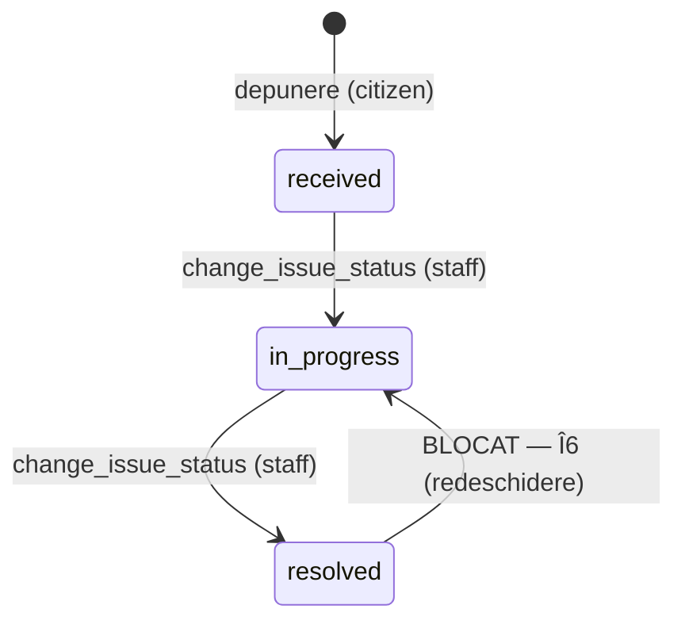

# Specificație tehnică: Sesizări cetățenești — nucleul (depunere, urmărire, inbox, istoric)

- **Status:** Draft
- **Feature brief:** [`docs/product/features/sesizari-cetatenesti-brief.md`](../../product/features/sesizari-cetatenesti-brief.md) (FEAT-001, `Draft`)
- **Domain review:** **Inexistent** — `docs/product/domain/` este gol. Orice comportament dependent de domeniu este tratat ca **blocat/necunoscut**, nu completat (vezi §25).
- **Task sursă:** [`docs/tasks/TASK-0004-tech-spec-sesizari.md`](../../tasks/TASK-0004-tech-spec-sesizari.md)
- **ADR-uri de care depinde:** [ADR-0001](../../decisions/ADR-0001-phase-1-technology-and-deployment-baseline.md), [ADR-0002](../../decisions/ADR-0002-tenancy-model-and-tenant-resolution.md), [ADR-0003](../../decisions/ADR-0003-authentication-and-role-model.md)
- **ADR-uri cerute de această spec (neexistente încă):** **ADR-0004** (funcțiile de workflow `change_issue_status` / `assign_issue`, `SECURITY DEFINER`), **FUP-3** (storage și acces la fișiere)
- **Ultima actualizare:** 2026-07-23

---

## 1. Rezumat

Această specificație acoperă **exclusiv nucleul** pe care [FEAT-001, §19](../../product/features/sesizari-cetatenesti-brief.md) îl declară avansabil în paralel, indiferent de blocante:

1. **Depunerea** unei sesizări de către un `citizen` autentificat (categorie, descriere, punct pe hartă; regim `semnalare` — [OQ-016](../../project/open-questions.md)).
2. **Urmărirea** de către cetățean a propriei sesizări și a istoricului ei.
3. **Inbox-ul** `staff`/`tenant_admin` cu filtre (status, categorie, responsabil, interval de depunere).
4. **Istoricul append-only al tranzițiilor** de status, separat de statusul curent.

Specificația introduce patru tabele noi cu `tenant_id` (`issue_categories`, `issues`, `issue_status_history`, `issue_assignment_history`), toate sub tiparul de izolare din ADR-0002/0003 (RLS + `FORCE`, predicat de rol legat prin `AND` de predicatul de tenant, `WITH CHECK` pe fiecare `UPDATE`, index cu `tenant_id` pe prima poziție — C6).

**Ce NU proiectează** (fiecare rămâne secțiune „Blocat de", §24): promisiunile de termen/număr de înregistrare către cetățean (B1/[OQ-003](../../project/open-questions.md)), publicarea/vizibilitatea fotografiei (B2), contractul complet de storage și retenția (FUP-3, B3/[OQ-007](../../project/open-questions.md)), dashboard-ul de indicatori (FUP-9), exportul PDF/spreadsheet (FUP-5), notificările (FUP-4).

**Împărțirea de pregătire (detaliată în §26):** coloana vertebrală de **citire și depunere** (submit + track + inbox reads) este `ready` pe baza ADR-0002/0003. **Acțiunile de mutare** (schimbare de status, atribuire) sunt `ready-cu-risc-acceptat`, condiționate de **ADR-0004** (funcție `SECURITY DEFINER` — stop condition #3 din `autonomy.md`).

## 2. Obiective

- Un model de date care permite depunerea, urmărirea și triajul fără a presupune niciun răspuns despre B1/B2/B3.
- Izolare multi-tenant **și** confidențialitate între cetățenii aceluiași tenant, aplicate în planul de date (nu în UI).
- Un istoric de tranziții **imuabil**, sursă de adevăr pentru indicatorii viitori (FUP-9), imposibil de ameliorat prin editarea statusului.
- Contracte de acțiune verificabile prin testele C\*/T\* existente, extinse cu scenarii cross-tenant și cross-rol pentru fiecare tabel nou.

## 3. Non-obiective

Nu se proiectează în această specificație (motivul și sursa în §24):

- Termen legal de răspuns, număr de înregistrare oficial, răspuns formal semnat — **B1 / [OQ-003](../../project/open-questions.md)**.
- Vizibilitatea și publicarea fotografiei; hartă publică — **B2** (decizie de produs/privacy, neînregistrată încă ca OQ numerotat).
- Contractul complet de storage (tipuri, dimensiuni, durata URL-urilor semnate) și retenția — **FUP-3**, **B3 / [OQ-007](../../project/open-questions.md)**.
- Dashboard și formule de indicatori — **FUP-9**.
- Export PDF/spreadsheet — **FUP-5**. Notificări (email, push) — **FUP-4**.
- Redeschiderea (`rezolvat → în lucru`) — **Î6** (decizie de produs, contradicție cu FUP-9, §8/§25).
- Obligativitatea fotografiei — **Î7**. Afișarea numelui funcționarului către cetățean — **Î9**. Păstrarea/eliminarea EXIF — **Î10**.
- Segmentarea inbox-ului pe compartimente / atribuirea către un **departament** — **[OQ-011](../../project/open-questions.md)** (FUP-14).
- Editarea unei sesizări depuse de către autor, anularea/ștergerea logică — nu sunt în scopul FEAT-001; Î8, §21.
- Blocarea tehnică a auto-procesării — **[OQ-013](../../project/open-questions.md)**; comportamentul implicit (înregistrare, nu blocare) este fixat de ADR-0003 și **respectat**, nu extins.
- Deduplicarea, comentariile, votul, fluxul de urgență — în afara scopului FEAT-001 (§6 din brief).

## 4. Context și constrângeri

Preluate fără relitigare din ADR-uri:

- **Un singur PostgreSQL** gestionat de Supabase, monolit modular ([ADR-0001](../../decisions/ADR-0001-phase-1-technology-and-deployment-baseline.md)).
- **Bază unică, schemă unică, `tenant_id` + RLS deny-by-default** ([ADR-0002](../../decisions/ADR-0002-tenancy-model-and-tenant-resolution.md)). Tenantul vine **exclusiv** din claim verificat JWT (`current_tenant_id()`); hostname-ul nu este niciodată frontieră.
- **Patru roluri cumulative** `citizen | staff | leadership | tenant_admin`; rolul vine din `app_metadata.app_role` prin hook; `has_role()` modelează cumulativitatea ([ADR-0003](../../decisions/ADR-0003-authentication-and-role-model.md)).
- **Migrații versionate, forward-only**, replay de la zero; niciun tabel cu `tenant_id` fără RLS + `FORCE` + politici în aceeași migrație (C1).
- **`OG 27/2002`**: „sesizarea" cade juridic sub definiția petiției. Faza 1 livrează **exclusiv semnalări informale** — [decizia OQ-016](../../project/open-questions.md#decizie-oq-016--faza-1-livrează-doar-semnalări-informale-nu-petiții). Modelul de date poartă `regim` de la început, cu **o singură valoare permisă: `semnalare`**, iar `petitie` trebuie să poată fi adăugat ca **valoare + flux în plus, niciodată rescriere**.
- Convenții de imitat: `supabase/migrations/*.sql` (tiparul de politici) și `packages/db-tests/tests/{catalogue,isolation}.test.mjs` (porțile C\*/T\*).

> **Notă de cod:** fragmentele SQL de mai jos sunt **ilustrative, nu migrații**. Exprimă forma schemei și intenția politicilor, în stilul ADR-0002/0003. Această specificație **nu produce cod** (`autonomy.md`).

## 5. Module afectate

| Modul | Responsabilitate | Motivul modificării |
|---|---|---|
| `db` (migrații + RLS) | Schema `issues`, `issue_status_history`, `issue_assignment_history`, `issue_categories`; politici tenant+rol | Tabele noi cu `tenant_id`; frontieră de tenant + confidențialitate între cetățeni |
| `db` (funcții workflow) | `change_issue_status`, `assign_issue` (`SECURITY DEFINER`) | Mutarea statusului/atribuirii trece exclusiv prin funcții validate (ADR-0003) → **necesită ADR-0004** |
| `packages/db-tests` | Extinderea `catalogue.test.mjs` (C\*) și `isolation.test.mjs` (T\*) | Fiecare tabel nou cu `tenant_id` cere scenariu cross-tenant negativ (`autonomy.md`, reguli DB) |
| `apps/app` (cetățean) | Formular depunere, listă proprie, detaliu cu istoric | FR-001…FR-011 |
| `apps/app` (administrare) | Inbox cu filtre, acțiune de status, acțiune de atribuire | FR-012…FR-021 |
| `apps/app` (storage) | Încărcarea/afișarea fotografiei | **Blocat** de FUP-3/B2/OQ-007 (§13) |

Domeniul de logică (validarea tranzițiilor, cumulativitatea rolurilor) trăiește în planul de date (funcții + RLS), nu în componente UI (`architecture.md`).

## 6. Diagramă de flux

```mermaid
sequenceDiagram
    actor C as Cetățean (citizen)
    participant App as apps/app
    participant PG as PostgreSQL (RLS)
    actor S as Funcționar (staff)

    C->>App: Completează categorie + pin + descriere (+ foto*)
    Note over App: *foto = BLOCAT (FUP-3/B2)
    App->>PG: INSERT issues (author=auth.uid(), tenant din claim, status=received)
    PG-->>App: rând creat (RLS: WITH CHECK tenant + author)
    App-->>C: Confirmare + identificator; apare în lista proprie (status „primit")

    S->>App: Deschide inbox (filtre)
    App->>PG: SELECT issues (RLS: tenant + has_role('leadership'))
    PG-->>App: toate sesizările tenantului, niciuna a altui tenant

    S->>App: „Preia" (received → in_progress)
    App->>PG: change_issue_status(id, 'received', 'in_progress')
    Note over PG: has_role('staff') + tranziție validă +<br/>lock rând + append issue_status_history +<br/>update status — o singură tranzacție
    PG-->>App: status nou
    App-->>C: în lista proprie apare „în lucru" + rând de istoric
```

## 7. Model conceptual de date

Entități noi, toate **deținute de tenant** (`tenant_id NOT NULL`, FK către `tenants`, `default (select public.current_tenant_id())`, index cu `tenant_id` pe prima poziție — ADR-0002).

### 7.1 Tipuri închise (enum)

```sql
-- ilustrativ, nu migrație
create type public.issue_status  as enum ('received', 'in_progress', 'resolved');
create type public.issue_regime  as enum ('semnalare');   -- Faza 1: O SINGURĂ valoare (OQ-016)
create type public.issue_acting_as as enum ('citizen', 'official');
```

- **Identificatorii de status sunt englezești** (`received/in_progress/resolved`); UI-ul îi mapează la etichetele românești `primit / în lucru / rezolvat` ([brief §12](../../product/features/sesizari-cetatenesti-brief.md); CLAUDE.md — identificatori în engleză, copy cetățean în română). Maparea trăiește în UI, nu în schemă.
- `issue_regime` are **exact** `semnalare`. `petitie` se adaugă ulterior prin `alter type ... add value` (compatibil înainte) **plus un flux nou** — niciodată rescriere (OQ-016, punctul 4). Enum, nu `text`: o valoare inexistentă este eroare de scriere, nu rând tăcut (tiparul `app_role`).

### 7.2 `issue_categories` (tabel de suport)

Motiv de a fi tabel, nu enum: ADR-0002 îl enumeră deja ca tabel per-tenant, public-readable, cu `is_active` — o comună fără operator de apă poate dezactiva `apa`. Setul rămâne **închis** în Faza 1 (FR-003) prin `check` pe `code` + seed la onboarding + management în afara scopului.

| Coloană | Tip | Note |
|---|---|---|
| `id` | uuid PK | |
| `tenant_id` | uuid NOT NULL | FK `tenants`, default din claim |
| `code` | text NOT NULL | `check (code in ('groapa','iluminat','gunoi','caini','apa'))` — set închis Faza 1 |
| `label` | text NOT NULL | etichetă românească cu diacritice (ex. „Groapă") |
| `is_active` | boolean NOT NULL default true | categorii dezactivabile per tenant |
| `sort_order` | int NOT NULL default 0 | ordine de afișare |
| `created_at` | timestamptz NOT NULL default now() | |

- `unique (tenant_id, code)` — o categorie o singură dată per tenant.
- `unique (tenant_id, id)` — **ținta FK-ului compozit** din `issues` (previne referirea unei categorii dintr-un alt tenant).
- Index `(tenant_id, is_active)`.
- **Seed la onboarding**: cele cinci categorii, per tenant. Managementul (CRUD) categoriilor este **în afara scopului** acestei spec.

### 7.3 `issues` (tabelul central)

| Coloană | Tip | Invariant / note |
|---|---|---|
| `id` | uuid PK | identificatorul afișat cetățeanului (FR-007) |
| `tenant_id` | uuid NOT NULL | FK `tenants`, default din claim; frontiera de tenant (FR-022) |
| `author_user_id` | uuid NOT NULL | default `auth.uid()`, FK `auth.users` `on delete restrict`; **nefalsificabil** (FR-023, §11) |
| `regim` | `issue_regime` NOT NULL default `'semnalare'` | OQ-016 |
| `category_id` | uuid NOT NULL | **FK compozit `(tenant_id, category_id) → issue_categories(tenant_id, id)`** — categoria aparține aceluiași tenant |
| `description` | text NOT NULL | `check (char_length between 1 and 2000)`; maximul se afișează înainte de depășire (FR-006) |
| `location_lat` | double precision NOT NULL | `check (-90..90)` |
| `location_lng` | double precision NOT NULL | `check (-180..180)` |
| `status` | `issue_status` NOT NULL default `'received'` | **proiecție**, nu sursă de adevăr (FR-021); mutat exclusiv de `change_issue_status` |
| `assigned_to` | uuid NULL | FK `auth.users`; responsabil-persoană; NULL = „neatribuit" (FR-013); atribuire-departament = **blocat OQ-011** |
| `client_submission_id` | uuid NOT NULL | idempotență la retrimitere (FR-008, §16) |
| `created_at` | timestamptz NOT NULL default now() | momentul depunerii (filtru FR-013) |
| `updated_at` | timestamptz NOT NULL default now() | |

- **`unique (tenant_id, author_user_id, client_submission_id)`** — o retrimitere a aceleiași încercări nu creează două sesizări (E6/FR-008).
- Indexuri (toate cu `tenant_id` pe prima poziție — C6): `(tenant_id, author_user_id, created_at)` (lista cetățeanului), `(tenant_id, status)`, `(tenant_id, category_id)`, `(tenant_id, assigned_to)`, `(tenant_id, created_at)` (inbox + filtre).
- **Locația = pinul confirmat** (FR-005/E7). EXIF-ul fotografiei nu este sursă de adevăr; păstrarea sau eliminarea EXIF este **Î10 (blocat)** și ține de contractul de storage (FUP-3), nu de acest tabel.
- **Fără `resolved_at` și fără câmpuri de durată.** Toate metricile de durată se derivă din `issue_status_history` (FUP-9): un câmp de durată ar fi o a doua sursă de adevăr, tentabilă la manipulare.
- **Fără `deleted_at` în Faza 1**: nu există acțiune în scop care să-l scrie (ștergere/anulare = Î8/Î11, blocate). Se adaugă când fluxul de ștergere este proiectat (schimbare additivă).

### 7.4 `issue_status_history` (append-only) — coloana vertebrală

Un rând **nou** per tranziție. Creația **nu** produce rând (AC-010: `received→in_progress→resolved` = exact **două** rânduri). Servește simultan ca **istoric de tranziții** (FUP-9) și ca **audit al schimbării de status** (ADR-0003).

| Coloană | Tip | Note |
|---|---|---|
| `id` | uuid PK | |
| `tenant_id` | uuid NOT NULL | denormalizat din `issues`; frontiera + index C6 |
| `issue_id` | uuid NOT NULL | FK `issues` `on delete restrict` |
| `from_status` | `issue_status` NOT NULL | statusul de plecare |
| `to_status` | `issue_status` NOT NULL | statusul de sosire |
| `actor_user_id` | uuid NOT NULL | FK `auth.users`; cine (ADR-0003) |
| `actor_role` | `app_role` NOT NULL | rolul efectiv din JWT la momentul acțiunii |
| `acting_as` | `issue_acting_as` NOT NULL | `'official'` pentru schimbare de status (determinat de acțiune, nu de UI) |
| `created_at` | timestamptz NOT NULL default now() | momentul tranziției; sursa pentru M3/M4 |

- **Append-only prin construcție**: fără `GRANT UPDATE/DELETE`, fără politici `UPDATE/DELETE`; **fără `INSERT` direct** pentru `authenticated` — scrierea trece exclusiv prin `change_issue_status` (§9). Astfel un client nu poate fabrica istoric (AC-011).
- Index `(tenant_id, issue_id, created_at)`.

### 7.5 `issue_assignment_history` (append-only)

Simetric cu istoricul de status; satisface „fiecare atribuire este înregistrată cu autor și moment" (FR-014).

| Coloană | Tip | Note |
|---|---|---|
| `id` | uuid PK | |
| `tenant_id` | uuid NOT NULL | denormalizat; frontieră + C6 |
| `issue_id` | uuid NOT NULL | FK `issues` |
| `previous_assignee` | uuid NULL | NULL = era neatribuită |
| `new_assignee` | uuid NULL | NULL = dezatribuită |
| `actor_user_id` | uuid NOT NULL | |
| `actor_role` | `app_role` NOT NULL | |
| `acting_as` | `issue_acting_as` NOT NULL | `'official'` |
| `created_at` | timestamptz NOT NULL default now() | |

- Append-only, la fel: scriere exclusiv prin `assign_issue` (§9).
- Index `(tenant_id, issue_id, created_at)`.

### 7.6 Invariants

1. Fiecare `issue`, `*_history` și `issue_category` aparține **exact unui tenant** (FR-022).
2. `issues.author_user_id = auth.uid()` la creare — autorul nu poate fi falsificat (FR-023).
3. `issues.category_id` referă întotdeauna o categorie a **aceluiași tenant** (FK compozit).
4. Statusul curent este o proiecție; numărul de rânduri de istoric **crește monoton** (AC-012).
5. Nicio ștergere fizică: nicio politică/`GRANT` `DELETE` pe niciun tabel din această spec (ADR-0002).

## 8. Stări și tranziții



| Din | În | Actor permis | Condiție |
|---|---|---|---|
| — | `received` | `citizen` (cumulativ: orice rol) | INSERT `issues`; nu produce rând de istoric |
| `received` | `in_progress` | `has_role('staff')` | tranziție validă; concurență controlată (E13) |
| `in_progress` | `resolved` | `has_role('staff')` | idem |
| `resolved` | `in_progress` | **nedefinit** | **BLOCAT — Î6.** Nu se implementează. |

- `leadership` și `citizen` **nu** pot schimba statusul (FR-015; matrice ADR-0003). Aplicat în planul de date: `change_issue_status` cere `has_role('staff')`.
- **Set de tranziții permise, închis în Faza 1**: `{received→in_progress, in_progress→resolved}`. Orice altă pereche este refuzată de funcție.
- **Contradicție cunoscută, marcată, nerezolvată:** FUP-9 presupune că redeschiderile există și trebuie tratate în formule; FR-018/Î6 lasă redeschiderea **nedecisă**. Consecință: **FR-020** (corecția unui status greșit printr-o „tranziție compensatorie înainte") **nu are cale de realizare** în Faza 1, pentru că singura compensare a unui `resolved` greșit ar fi `resolved→in_progress` — exact redeschiderea blocată de Î6. Această spec **nu decide Î6**; o semnalează ca întrebare deschisă (§25). Modelul append-only permite adăugarea tranziției fără rescriere dacă Î6 se decide „da".

## 9. Contracte de interfață

Toate accesele autentificate trec prin PostgREST cu **cheia anon + JWT de utilizator**, sub RLS. `service_role` nu apare niciodată în client (V2/ADR-0001).

### 9.1 Depunere — INSERT direct sub RLS (fără funcție)

- **Operație:** `INSERT INTO issues (category_id, description, location_lat, location_lng, client_submission_id)`.
- `tenant_id`, `author_user_id`, `status`, `regim` **nu se trimit de client**: vin din default-uri (claim / `auth.uid()` / `'received'` / `'semnalare'`). Chiar dacă sunt trimise, `WITH CHECK` le respinge dacă nu corespund (§11).
- **Idempotență:** clientul generează `client_submission_id` **o singură dată** per încercare; retrimiterea reutilizează aceeași valoare. La conflict pe `unique (tenant_id, author_user_id, client_submission_id)`, contractul recomandat este `INSERT ... ON CONFLICT DO NOTHING RETURNING *`, urmat de un `SELECT` al rândului existent → clientul tratează conflictul drept **succes**, nu eroare (E6).
- **Nu necesită ADR-0004** — este cale avansabilă acum.

### 9.2 `change_issue_status` — funcție `SECURITY DEFINER` (necesită ADR-0004)

```
change_issue_status(p_issue_id uuid, p_expected_status issue_status, p_to_status issue_status)
  returns issue_status
```

Comportament (o singură tranzacție):

1. Citește `tenant`/`rol` ale **apelantului** din `auth.jwt()` (disponibil și sub `SECURITY DEFINER`, fiind un GUC de request).
2. **Autorizare:** dacă `not has_role('staff')` → excepție (refuz pentru `leadership` și `citizen`).
3. **Blocare rând:** `SELECT ... FOR UPDATE` pe `issues` unde `id = p_issue_id AND tenant_id = current_tenant_id()`. Rând inexistent în tenantul apelantului → refuz (nu dezvăluie existența în alt tenant).
4. **Concurență (E13):** dacă `status <> p_expected_status` → refuz determinist („sesizarea a fost deja modificată"). O singură tranziție reușește; a doua eșuează curat.
5. **Validare tranziție:** `(p_expected_status, p_to_status)` trebuie să fie în setul permis (§8). Altfel refuz. Redeschiderea rămâne blocată (Î6).
6. **Append istoric:** INSERT în `issue_status_history` (`from = p_expected_status`, `to = p_to_status`, `actor_user_id`, `actor_role`, `acting_as = 'official'`, `tenant_id`).
7. **Proiecție:** UPDATE `issues.status = p_to_status`, `updated_at = now()`.
8. Return `p_to_status`.

- **Auto-procesarea** (`actor_user_id = author_user_id`) este **înregistrată, nu blocată** (ADR-0003, FR-016, [OQ-013](../../project/open-questions.md)). Faptul este vizibil în istoric prin egalitatea celor două id-uri; UI-ul de administrare îl arată explicit (AC-017). **Nu se inventează blocare.**
- **Punct de proiectat în ADR-0004:** mecanismul exact prin care funcția scrie sub `FORCE ROW LEVEL SECURITY` (proprietarul funcției, contextul de execuție), fără a introduce o cale de bypass generală. Interdicția `service_role` în client rămâne.

### 9.3 `assign_issue` — funcție `SECURITY DEFINER` (necesită ADR-0004)

```
assign_issue(p_issue_id uuid, p_assignee uuid /* nullable */)
  returns void
```

1. `has_role('staff')` altfel refuz (`leadership`/`citizen` refuzați).
2. `SELECT ... FOR UPDATE` pe `issues` în tenantul apelantului; inexistent → refuz.
3. Dacă `p_assignee is not null`: verifică existența unui rând **activ** în `tenant_users` pentru `p_assignee` în **același tenant**. **Atribuirea către un departament este blocată de [OQ-011](../../project/open-questions.md)** — Faza 1 atribuie doar unei persoane.
4. Append `issue_assignment_history` (`previous_assignee`, `new_assignee`, actor, `acting_as='official'`).
5. UPDATE `issues.assigned_to`, `updated_at = now()`.

### 9.4 Citiri

- **Lista cetățeanului:** `SELECT ... FROM issues` — RLS restrânge la `author_user_id = auth.uid()` (FR-009).
- **Detaliu + istoric propriu:** `SELECT` pe `issues` + `issue_status_history` join pe `issue_id`; RLS restrânge la sesizările proprii.
- **Inbox staff:** `SELECT ... FROM issues` cu filtre ca parametri PostgREST (`status=eq.`, `category_id=eq.`, `assigned_to=is.null`/`=eq.`, `created_at=gte./lte.`). RLS aplică `tenant + has_role('leadership')`. **Filtrele de client pot doar restrânge; nu pot lărgi frontiera** (nu pot expune alt tenant sau, pentru un cetățean, alte sesizări).

## 10. Validare

| Câmp | Regulă | Aplicare | AC |
|---|---|---|---|
| `category_id` | obligatoriu; una din cele 5 categorii **active** ale tenantului | FK compozit (same-tenant) + `NOT NULL`; o a 6-a valoare = eroare FK (server) | AC-002, AC-003 |
| `description` | obligatoriu, 1..2000 caractere | `NOT NULL` + `check`; maxim afișat înainte de depășire (UI) | AC-002 |
| `location_lat/lng` | obligatoriu; interval valid | `NOT NULL` + `check` de interval | AC-002, AC-004 |
| pin vs. EXIF | sursa = pin | se stochează doar pinul; EXIF neconsiderat (Î10 pt. storage) | AC-005 |
| `author_user_id` | = `auth.uid()` | `WITH CHECK` la INSERT | FR-023 |
| `tenant_id` | = claim | default + `WITH CHECK` | AC-007 |
| tranziție status | doar setul permis | `change_issue_status` | AC-008/009/010 |
| fotografie | **obligatorie sau opțională = Î7 (nedecis)** → **nu se impune** obligativitatea | schema nu cere atașament | E9 |

- **Refuz de la server, nu doar din UI** (AC-003, `security.md`): categoria invalidă cade pe FK; câmpurile lipsă cad pe `NOT NULL`/`check`; tranziția interzisă cade în funcție.
- **E11 (fișier care nu e fotografie):** validarea tip/dimensiune/proprietate ține de contractul de storage — **blocat FUP-3** (§13).

## 11. Autentificare și autorizare

Aplicat integral în planul de date; UI-ul nu autorizează (`security.md`). Fiecare politică are forma `tenant_id = (select current_tenant_id()) AND <predicat de rol>` (ADR-0003, C8).

```sql
-- ilustrativ (issues) — frontieră de tenant ȘI de proprietate/rol

alter table public.issues enable row level security;
alter table public.issues force  row level security;

-- SELECT — cetățeanul: doar rândurile lui (confidențialitate între cetățenii aceluiași tenant)
create policy issues_select_own_as_citizen on public.issues for select to authenticated
  using ( tenant_id = (select public.current_tenant_id())
      and author_user_id = (select auth.uid()) );

-- SELECT — roluri elevate: toate sesizările tenantului (has_role('leadership') include staff/tenant_admin)
create policy issues_select_all_in_tenant_elevated on public.issues for select to authenticated
  using ( tenant_id = (select public.current_tenant_id())
      and (select public.has_role('leadership')) );

-- INSERT — oricine, în tenantul lui, ca autor al lui însuși (cumulativitate: has_role('citizen') = true pt. toți)
create policy issues_insert_own_as_citizen on public.issues for insert to authenticated
  with check ( tenant_id = (select public.current_tenant_id())
           and author_user_id = (select auth.uid())
           and (select public.has_role('citizen')) );

-- Fără politică UPDATE pentru `authenticated` pe issues: statusul/atribuirea se schimbă
-- EXCLUSIV prin funcțiile din §9. Editarea de către autor nu e în scop (Î8).
-- Fără politică DELETE nicăieri.
```

- **Coloane sensibile:** `status`, `assigned_to` **nu** se acordă la nivel de coloană rolului `authenticated` (`revoke update ... ; grant update (...) ...` fără ele — tiparul ADR-0003). Schimbarea lor trece doar prin funcțiile `SECURITY DEFINER`.
- **`issue_status_history` / `issue_assignment_history`:** `SELECT` cu aceleași două politici (proprie pentru `citizen` via join la `issues.author_user_id`, tenant pentru elevate); **fără** `INSERT/UPDATE/DELETE` pentru `authenticated`.
- **`issue_categories`:** `SELECT` `authenticated` pe propriul tenant (necesar pentru formular); **fără scriere** pentru `authenticated` (seed la onboarding; management out of scope). **Citirea publică `anon`** (prevăzută în ADR-0002) este **amânată** la lucrul pe site-ul public (FUP-8); nu se adaugă aici. C5 rămâne satisfăcut (subsetul de tabele `anon`-readable nu crește).

Matrice (extras din ADR-0003, aplicabil acestei spec):

| Acțiune | `citizen` | `staff` | `leadership` | `tenant_admin` |
|---|:--:|:--:|:--:|:--:|
| Creează sesizare | DA | DA | DA | DA |
| Citește propriile sesizări | DA | DA | DA | DA |
| Citește sesizările altui cetățean (același tenant) | **NU** | DA | DA | DA |
| Schimbă status / atribuie | NU | **DA** | **NU** | **DA** |
| Citește sesizări din alt tenant | **NU** | **NU** | **NU** | **NU** |

## 12. Izolare multi-tenant

Adresează [R-002](../../project/risk-register.md). Comportament pe fiecare rută prin care datele pot ieși:

- **Read:** RLS `tenant_id = current_tenant_id()` pe toate cele patru tabele; cetățeanul e restrâns suplimentar la `author_user_id = auth.uid()`. Hostname irelevant (T15/ADR-0002).
- **Write:** `WITH CHECK` pe INSERT-ul `issues` împiedică scrierea în alt tenant și falsificarea autorului. Funcțiile de workflow verifică `tenant_id = current_tenant_id()` pe rândul blocat.
- **Fișiere:** convenția `issue-attachments/{tenant_id}/{issue_id}/...` din ADR-0002 este frontiera; **contractul complet e blocat FUP-3** (§13). Frontiera de storage pentru sesizări este exact suprafața **netestată azi** semnalată în nota R-002 — devine testabilă doar când FUP-3 o definește.
- **Export:** **în afara scopului** (FUP-5). Când apare, se generează server-side sub JWT-ul utilizatorului (sub RLS), fără `tenant_id` de la client (ADR-0002).
- **Joburi de fundal:** niciunul introdus de această spec.
- **Analytics/dashboard:** **în afara scopului** (FUP-9); indicatorii se vor calcula sub RLS, din `issue_status_history`.

**C6 (index cu `tenant_id` pe prima poziție)** este respectat de toate cele patru tabele (§7). **C1/C1b** impun RLS + `FORCE` + politici în aceeași migrație — altfel build roșu.

## 13. Fișiere și atașamente

**BLOCAT — B2 (vizibilitate) + [OQ-007](../../project/open-questions.md) (retenție) + FUP-3 (contract de storage).**

Ce este **fixat** (ADR-0002) și nu se relitighează: bucket **privat** `issue-attachments`, cale `{tenant_id}/{issue_id}/{uuid}.{ext}` cu `tenant_id` ca prim segment = token de autorizare, politici RLS pe `storage.objects` (`USING`/`WITH CHECK` pe primul segment), livrare prin **URL-uri semnate cu durată scurtă**, niciodată URL public ghicibil (FR-024).

Ce **nu se proiectează aici** (blocat):

- **Cine vede fotografia și descrierea** (doar autor+primărie / public / public fără foto) — **B2**. Presupunerea implicită a brief-ului este cea mai restrictivă (autor + primărie), dar rămâne **presupunere, nu decizie**. O fotografie publicată nu se depublică — alegerea nu e reversibilă.
- **Tipuri/dimensiuni permise, durata URL-ului semnat, cine îl poate emite, predicatul de rol pe storage** (cetățean vede atașamentele **sesizărilor lui**; elevate — pe ale tenantului) — **FUP-3**.
- **Retenția** fotografiilor și **tratarea EXIF** (Î10) — **OQ-007 / B3**.
- **Obligativitatea fotografiei** la depunere — **Î7**.

Consecință de scop: **nucleul de depunere poate avansa fără fotografie** (text + categorie + pin). Tabelul de atașamente (probabil `issue_attachments(tenant_id, issue_id, storage_path, ...)`) și încărcarea/afișarea imaginii **nu se proiectează** până la FUP-3.

## 14. Audit și trasabilitate

- Schimbarea de status este auditată **în `issue_status_history`** însuși: `actor_user_id`, `actor_role`, `acting_as = 'official'`, `created_at`, `tenant_id` (ADR-0003, punctul 15). Nu se suprascrie.
- Atribuirea este auditată în `issue_assignment_history` (aceeași structură).
- **Auto-procesare vizibilă (R-006):** când `actor_user_id = issues.author_user_id`, faptul e derivabil din date și afișat în UI-ul de administrare (AC-017). Nu se blochează (OQ-013).
- **Un `audit_log` general** (pentru export, administrare de conturi etc.) **nu este** obiectul acestei spec. Exportul și auditul lui (FR-027) sunt în afara scopului (FUP-5). Cele două tabele append-only de mai sus acoperă integral acțiunile de workflow din scop.
- **Retenția rândurilor de audit** care conțin `actor_user_id`: **nestabilită — OQ-007. Nu se inventează.**

## 15. Notificări

**În afara scopului — FUP-4.** Nicio notificare (email, push) nu este declanșată de această spec. Numărul de înregistrare pe email, push la schimbarea de status — brief §6 și FUP-4. Identificatorul din FR-007 este `issues.id`, afișat pe ecran; **nu** este un număr de înregistrare oficial (B1).

## 16. Erori, retry și idempotency

- **Depunere idempotentă (FR-008, E6):** `client_submission_id` + `unique (tenant_id, author_user_id, client_submission_id)`. Retrimiterea aceleiași încercări → conflict tratat ca succes (§9.1). Datele introduse nu se pierd (comportament de client: păstrarea formularului; mecanismul concret — coadă locală / service worker — e decizie de UI, nu de această spec).
- **Concurență la status (E13):** `p_expected_status` + `SELECT ... FOR UPDATE` → o singură tranziție reușește, cealaltă e refuzată determinist; **nu** apar două rânduri de istoric contradictorii.
- **Respingere RLS ≠ 200 „a mers":** un UPDATE/DELETE respins de `USING` întoarce `200 []` (zero rânduri), nu 403 ([MEMORY: RLS denial](../../../)); doar `WITH CHECK` ridică 403. Clientul verifică **rândurile afectate**, nu codul HTTP (AC-008 se verifică pe **starea stocată**). Funcțiile de workflow ridică **excepții explicite** la refuz, evitând ambiguitatea lui `200 []`.
- **Erori interne:** fără stack trace / detalii de implementare returnate utilizatorului (`security.md`).

## 17. Confidențialitate și date personale

Conform brief §11. Categorii atinse: identitatea autorului (necesară pentru urmărire și pentru protecția față de vecin), descrierea și fotografia (pot conține date ale terților — E3/E4), pinul (cvasi-identificator).

- **Confidențialitate între cetățenii aceluiași tenant** aplicată în planul de date: `author_user_id = auth.uid()` (D3/ADR-0003). Un vecin nu poate citi sesizarea altuia nici cu interogare directă (AC-006).
- **`leadership` citește toate sesizările tenantului** — privilegiu de **lectură** asupra datelor personale, justificat operațional, spus explicit (ADR-0003, consecința 5).
- **Nedecis, marcat (nu se inventează):** vizibilitatea fotografiei (**B2**), retenția (**OQ-007/B3**), comportamentul la ștergerea contului (**Î11** — tensiune reală: istoricul e audit-relevant, dar sesizarea poartă date personale).
- **Minimizare:** schema nu stochează EXIF (Î10 rămâne pentru storage); nu stochează câmpuri de durată redundante.

## 18. Accesibilitate

Cerințe non-funcționale (brief §12), de dus în UI, nu în schemă:

- Interfața cetățean în **română cu diacritice**, limbaj neadministrativ; etichetele stărilor sunt `primit / în lucru / rezolvat` (identificatorii tehnici nu se expun).
- Acțiune primară unică, vizibilă fără scroll pe telefon.
- Formular parcurgibil cu tastatura; etichete asociate; erori **legate de câmpul** care le-a produs (AC-002).
- Fotografia are text alternativ; harta are o alternativă non-vizuală (ex. adresa rezultată) — **măsura exactă rămâne problemă de design, numită, nu ascunsă**.
- **Explicăm de ce cerem locația.**
- **Nivelul de conformitate (WCAG) nu este fixat de brief** și rămâne de stabilit ca cerință non-funcțională explicită înainte de release cetățean (§25).

## 19. Performanță și limite

- Toate interogările de listă/inbox lovesc indexuri cu `tenant_id` pe prima poziție; `EXPLAIN` cu RLS activ nu trebuie să producă `Seq Scan` pe `issues` la volum (analog P1/ADR-0002).
- `(select public.has_role(...))` și `(select public.current_tenant_id())` — forma cu `select` (InitPlan), evaluată o dată, nu per rând.
- **Zgomot de vecin** (o primărie cu volum mare) — nedefinit ca prag ([OQ-010](../../project/open-questions.md)); nu se inventează.
- Limita descrierii: 2000 caractere (validare, nu limită legală).

## 20. Observabilitate

- **Sentry** cu scrubbing de PII (ADR-0001): fără corpuri de request, fără descrieri de sesizare, fără coordonate, fără token-uri în evenimente.
- Funcțiile de workflow ar trebui să întoarcă erori **clasificate** (neautorizat / tranziție invalidă / conflict de concurență) pentru a distinge cauzele în loguri — fără a expune detalii interne utilizatorului.
- Metrici operaționale (rate de finalizare a formularului A1, eșec de trimitere A2, procent de preluare A3 — brief §13) sunt **de instrumentat**, dar pragurile sunt **TBD pe date de pilot**, nu presupuse.
- **Retenția logurilor: OQ-007. Nu se inventează.**

## 21. Migrare și compatibilitate

- Start pe teren gol; disciplină de schemă din ADR-0001/0002: **migrații versionate, forward-only, replay de la zero**.
- **O singură migrație** creează un tabel cu `tenant_id` **împreună** cu RLS + `FORCE` + politicile lui (C1). Cele patru tabele + enum-urile + funcțiile intră coerent, după schema de tenancy existentă.
- **Enum-urile sunt extensibile înainte:** `issue_regime` primește `petitie` prin `add value` (OQ-016); `issue_status` poate primi stări intermediare (IP-3) fără rescriere. **Eliminarea** unei valori de enum nu e compatibilă (PostgreSQL) — de aici importanța de a nu adăuga valori speculative acum.
- **FK compozit** `(tenant_id, category_id)` cere `unique (tenant_id, id)` pe `issue_categories` — de creat înainte de `issues`.
- Compatibilitate client–schemă: cele două aplicații se pot deploya la momente diferite; schema nouă trebuie tolerată de versiunea live (expand/contract).
- **`autonomy.md` #3:** funcțiile `SECURITY DEFINER` (`change_issue_status`, `assign_issue`) **nu pot fi scrise fără ADR acceptat + marker `-- guard-approved: ADR-0004`** în migrație. Această spec le definește contractul; **ADR-0004 trebuie să preceadă implementarea**.

## 22. Rollback

- **Forward-only** (ADR-0001): nu ne bazăm pe migrații de rollback automate. O politică/funcție greșită se corectează printr-o **migrație corectivă înainte**, nu prin editare în consolă.
- Schimbări distructive (drop de coloană/tabel) — în pași **expand/contract** separați. În Faza 1 nucleul nu are drop-uri.
- Recuperarea de date rămâne prin restaurare din backup (procedura de restaurare selectivă per tenant **nu există** — [OQ-008](../../project/open-questions.md), în afara scopului).

## 23. Strategie de testare

Extinde suitele existente (`packages/db-tests`), **rulate exclusiv cu cheia anon** pe schema reală produsă de replay. Fiecare tabel nou cu `tenant_id` primește cel puțin un scenariu cross-tenant **negativ** (`autonomy.md`, reguli DB).

### 23.1 Structurale (C\*) — extindere automată

`catalogue.test.mjs` scanează **toate** tabelele cu `tenant_id`; adăugarea celor patru tabele este acoperită fără cazuri noi de:

- **C1/C1b** — RLS + `FORCE` + ≥1 politică pe fiecare (build roșu altfel).
- **C2** — nicio politică `USING(true)`/`WITH CHECK(true)`.
- **C3** — orice `UPDATE` are `WITH CHECK` (aici: politicile de UPDATE lipsesc pe `issues`; se aplică dacă se adaugă).
- **C4** — `anon` fără scriere.
- **C6** — index cu `tenant_id` pe prima poziție pe fiecare tabel nou.
- **C8** — fiecare politică conține `current_tenant_id()` (predicat de tenant, legat prin `AND`).

Caz structural **nou** propus:
- **C14 (nou)** — `issue_status_history` și `issue_assignment_history` **nu au** `GRANT`/politici `INSERT/UPDATE/DELETE` pentru `authenticated` (append-only impus la nivel de privilegiu, nu doar de politică).

### 23.2 Izolare și rol (T\*) — cazuri noi (continuă numerotarea din ADR-0003, T45)

| # | Caz | Rezultat cerut | AC |
|---|---|---|---|
| T46 | `citizen` A face `select` pe `issues` unde există sesizări ale lui A **și** ale altui cetățean **din același tenant** | strict sesizările lui A | AC-006 |
| T47 | `citizen` A cere explicit `id`-ul sesizării altui cetățean (același tenant) | 0 rânduri | AC-006 |
| T48 | `citizen` A face `insert` `issues` cu `author_user_id` = alt user | eroare (`WITH CHECK`) — autor nefalsificabil | FR-023 |
| T49 | `citizen` A face `insert` cu `tenant_id` = B | eroare (`WITH CHECK`) | AC-007 |
| T50 | utilizator A autentificat cerând sesizările pe subdomeniul lui B | identic cu izolarea normală: 0 rânduri ale lui B | AC-007 |
| T51 | `staff` A face `select` nefiltrat pe `issues` | toate sesizările lui A, **zero** ale lui B | AC-014 |
| T52 | `citizen` A apelează `change_issue_status` pe sesizarea proprie | refuz; status neschimbat **și** niciun rând nou de istoric | AC-008 |
| T53 | `leadership` A apelează `change_issue_status` / `assign_issue` | refuz (`has_role('staff')` = false), verificat pe starea stocată | AC-009 |
| T54 | `staff` A: `change_issue_status(id,'received','in_progress')` apoi `('in_progress','resolved')` | reușesc; `issue_status_history` = exact **două** rânduri, în ordine, cu actor+moment | AC-010 |
| T55 | `staff` A: `change_issue_status` cu `p_expected_status` greșit (concurență) | refuz determinist; fără rând nou | E13 |
| T56 | `staff` A: tranziție interzisă `received → resolved` sau `resolved → in_progress` | refuz (redeschidere blocată — Î6) | FR-018 |
| T57 | orice rol încearcă `update`/`delete` direct pe un rând din `issue_status_history` | refuz / 0 rânduri; rândul rămâne identic (append-only) | AC-011 |
| T58 | `citizen` A face `select` pe `issue_status_history` al sesizării altui cetățean (același tenant) | 0 rânduri | AC-006 |
| T59 | `staff` A: `assign_issue` către un user activ din A | reușește; rând în `issue_assignment_history`; `assigned_to` actualizat | FR-014 |
| T60 | `staff` A: `assign_issue` către un user al lui B | refuz (assignee nu e în tenantul A) | FR-014 |
| T61 | `citizen` A face `insert`/`update`/`delete` pe `issue_categories` | refuz | §11 |
| T62 | `citizen`/`staff` A face `select` pe `issue_categories` al lui B (explicit tenant B) | 0 rânduri | R-002 |
| T63 | control pozitiv: `staff` A creează o sesizare **ca cetățean** | reușește; `author_user_id` = el; audit la prima tranziție: `actor_role='staff'`, `acting_as='citizen'`/`'official'` corect | FR-016, AC-016 |

- **Verificarea AC-008/AC-009 se face pe starea stocată** (status + număr de rânduri de istoric), nu pe codul HTTP (nota RLS `200 []`).
- **Idempotența (FR-008):** test de integrare — două INSERT-uri cu același `client_submission_id` produc **o singură** sesizare.

### 23.3 Alte niveluri

- **Integrare:** funcțiile de workflow (autorizare, tranziții, concurență) — după ADR-0004.
- **E2E:** fluxul cetățean (depunere → apariție în listă cu „primit") și fluxul staff (preluare → istoric), pe date de test cunoscute (AC-001, AC-010, AC-014, AC-015).
- **Poartă CI:** C\*/T\* rămân blocante; `pnpm db:reset && pnpm test:db` verde înainte de PR.

## 24. Blocante (secțiuni explicite „Blocat de")

Fiecare blocant apare aici cu OQ-ul sursă. Niciunul **nu** se proiectează în această spec.

### B1 — Promisiuni de termen / număr de înregistrare / răspuns formal către cetățean

**Blocat de [OQ-003](../../project/open-questions.md) (Open).** [OQ-016](../../project/open-questions.md#decizie-oq-016--faza-1-livrează-doar-semnalări-informale-nu-petiții) a stabilit că Faza 1 livrează **semnalări informale** — ceea ce **deblochează nucleul** de față. Rămâne însă blocat orice ce ține de **practica reală a primăriei pilot**: dacă tratează de facto sesizările ca petiții (termen de 30 de zile, număr de înregistrare, răspuns semnat). Până la OQ-003: `issues.id` **nu** este număr de înregistrare oficial; produsul **nu** afișează termene și **nu** promite un răspuns formal. Coloana `regim` există (`semnalare`) tocmai pentru a nu exclude regimul de petiție ulterior.

### B2 — Cine vede fotografia și descrierea; publicarea fotografiei

**Blocat de B2 (decizie de produs/privacy, neînregistrată încă drept OQ numerotat; înrudită cu [OQ-007](../../project/open-questions.md) și ADR-0003 D3).** Vizibilitatea (autor+primărie / public / public fără foto) determină întregul contract de acces la fișiere. Nu se proiectează; presupunerea restrictivă rămâne presupunere. **Recomandare (§25): înregistrarea lui B2 ca OQ propriu.**

### B3 — Retenția sesizărilor, fotografiilor, istoricului și logurilor

**Blocat de [OQ-007](../../project/open-questions.md) (Open).** Nestabilită, nu se inventează (`security.md`). Tensiune reală și nerezolvată: istoricul e audit-relevant (nu se suprascrie), dar poartă date personale. Include comportamentul la ștergerea contului (Î11).

### Contractul de storage pentru fotografii

**Blocat de FUP-3 + B2 + [OQ-007](../../project/open-questions.md).** Mecanismul (bucket privat, cale cu `tenant_id`, URL-uri semnate) e fixat de ADR-0002; tipurile/dimensiunile/durata/predicatul de rol/retenția — FUP-3. Vezi §13.

### Alte elemente în afara scopului

- **Dashboard / indicatori (M1–M6):** **FUP-9**.
- **Export PDF/spreadsheet (FR-025–027):** **FUP-5**.
- **Notificări (email/push):** **FUP-4**.
- **Segmentare pe compartimente / atribuire la departament:** **[OQ-011](../../project/open-questions.md)** (FUP-14). Dacă răspunsul e „da", inboxul (FR-012) și `assign_issue` se schimbă structural.

## 25. Întrebări deschise

Semnalate, **nerezolvate** (autonomy.md — agentul nu decide întrebări de produs/juridice):

- **Î6 — redeschidere `rezolvat → in_progress`?** Contrazice presupunerea FUP-9 și face FR-020 nerealizabil în Faza 1 (§8). **Decizie de produs.** *Recomand înregistrare ca OQ.* Owner: Product owner + reprezentantul primăriei.
- **Î7 — fotografia obligatorie la depunere?** Schema nu o impune până la decizie. Owner: Product owner.
- **Î9 — vede cetățeanul numele funcționarului care i-a schimbat statusul?** Coloana `actor_user_id` există; **expunerea numelui către cetățean rămâne nedecisă** — UI-ul cetățean nu o afișează până la decizie. *Recomand înregistrare ca OQ.* Owner: Product owner + reprezentantul primăriei.
- **Î10 — se păstrează sau se elimină EXIF?** Ține de storage (FUP-3) + retenție (OQ-007).
- **B2** — vizibilitatea fotografiei — *recomand înregistrare ca OQ propriu.*
- **Nivelul WCAG** țintă pentru interfața cetățean — de fixat ca cerință non-funcțională. Owner: Product/UX.
- **[OQ-011](../../project/open-questions.md)** — compartimente/departamente; **[OQ-013](../../project/open-questions.md)** — blocarea auto-procesării (implicit: înregistrată, nu blocată — respectat); **[OQ-007](../../project/open-questions.md)** — retenție; **[OQ-003](../../project/open-questions.md)** — practica de registratură a primăriei pilot.

## 26. Decizia de pregătire

- **Decizie:** **Ready with accepted risks** (pentru coloana vertebrală de citire/depunere) **+ Blocked** pentru părțile enumerate la §24.

Împărțire onestă:

| Parte | Stare | Motiv |
|---|---|---|
| Schema `issue_categories`, `issues`, `issue_status_history`, `issue_assignment_history` + RLS tenant/rol + teste C\*/T\* | **Ready** | Complet definită pe ADR-0002/0003; nu depinde de niciun OQ deschis |
| Depunere (INSERT sub RLS), urmărire, inbox reads cu filtre | **Ready** | Nu necesită funcții `SECURITY DEFINER`; avansabil imediat |
| `change_issue_status`, `assign_issue` (mutări de status/atribuire) | **Ready with accepted risks** | Contract definit, dar implementarea cere **ADR-0004** (funcție `SECURITY DEFINER`, `autonomy.md` #3) înainte de scriere |
| Fotografii/atașamente | **Blocked** | FUP-3 + B2 + OQ-007 |
| Termene/număr de înregistrare/răspuns formal | **Blocked** | B1 / OQ-003 |
| Dashboard, export, notificări | **Blocked / out of scope** | FUP-9, FUP-5, FUP-4 |
| Redeschidere + corecția FR-020 | **Blocked** | Î6 |

- **Blockers:** B1/OQ-003; B2; B3/OQ-007; FUP-3 (storage); FUP-9 (dashboard); FUP-5 (export); FUP-4 (notificări); Î6 (redeschidere → afectează FR-020 și contradicția cu FUP-9); Î7; Î9; OQ-011 (structura inbox/atribuire).
- **Riscuri acceptate:**
  - Frontiera de tenant pentru **storage** rămâne neverificată până la FUP-3 (nota R-002) — atașamentele nu se construiesc până atunci.
  - Fereastra de revocare a rolului ([R-005](../../project/risk-register.md)) și ambiguitatea de audit la auto-procesare ([R-006](../../project/risk-register.md)) sunt moștenite din ADR-0003 și **respectate** (înregistrare, nu blocare), nu agravate.
  - Refacere posibilă a inboxului dacă OQ-011 impune segmentare pe compartimente.
- **ADR-uri necesare ulterior:**
  - **ADR-0004 (nou, blocant pentru mutări):** contractul funcțiilor de workflow `change_issue_status` / `assign_issue` — `SECURITY DEFINER`, autorizare din `auth.jwt()`, validarea tranzițiilor, controlul concurenței (`FOR UPDATE` + `expected_status`), scriere append-only în aceeași tranzacție, și **mecanismul de execuție sub `FORCE ROW LEVEL SECURITY`** fără cale de bypass generală.
  - **FUP-3 (preexistent, blocant pentru fotografii):** storage și acces la fișiere, cu predicat de rol (cetățean vede atașamentele sesizărilor lui; elevate — ale tenantului).
  - Eventual **ADR de stocare a locației** dacă apare o cerință spațială (deduplicare, verificare UAT E1, hartă): trecerea de la `lat/lng` la PostGIS este additivă. În Faza 1 se decide, cu justificare, **`double precision` lat/lng** (fără cerință spațială în nucleu).
